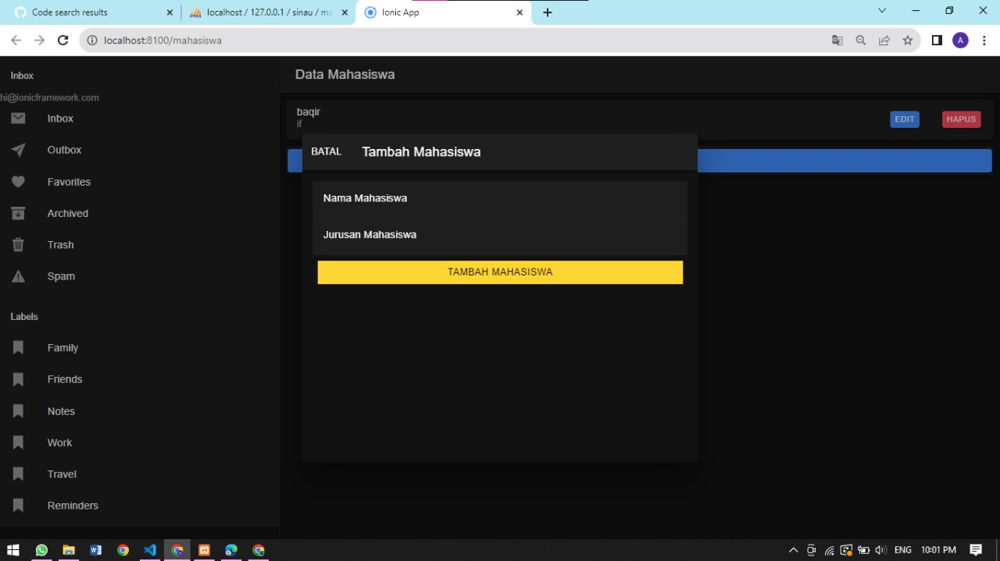
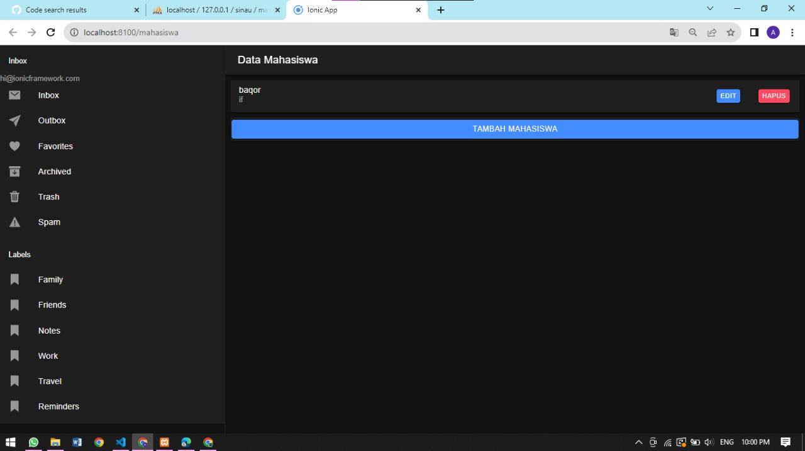

# crud_ionic

Tugas Pertemuan 10:
Silahkan lanjutkan modul CRUD hari ini, eksplor mandiri dan desain UI aplikasinya sekreatif kalian. Masukkan codenya ke dalam repo dan lampirkan screenshots tampilan UInya.

